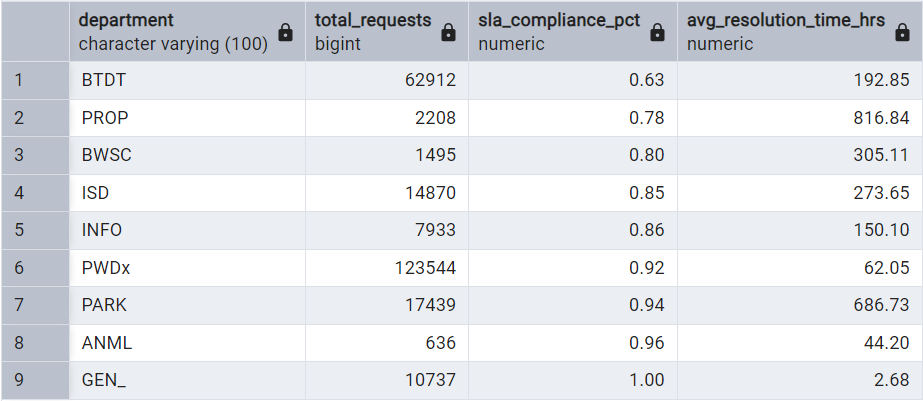
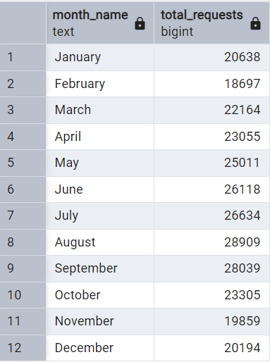
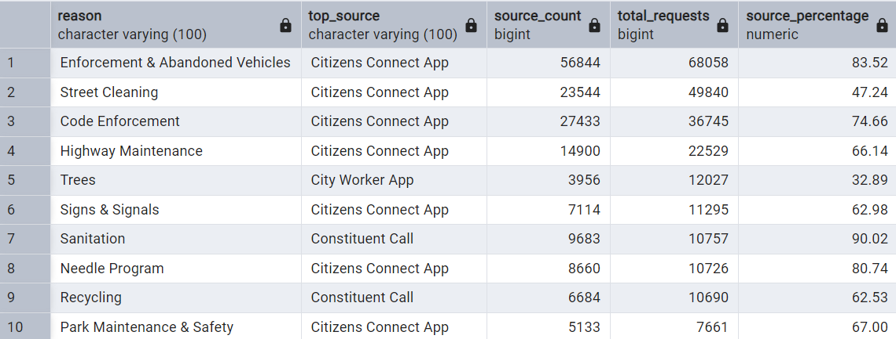
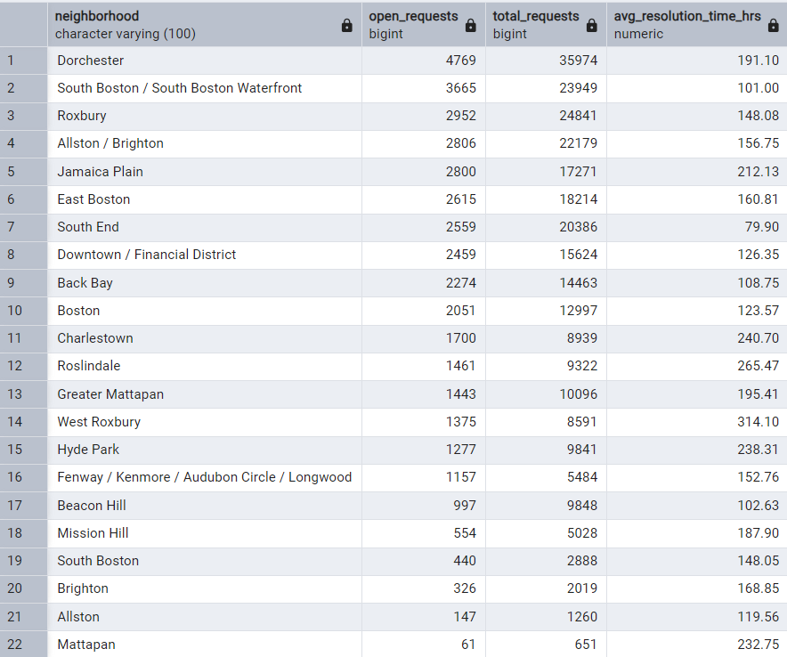
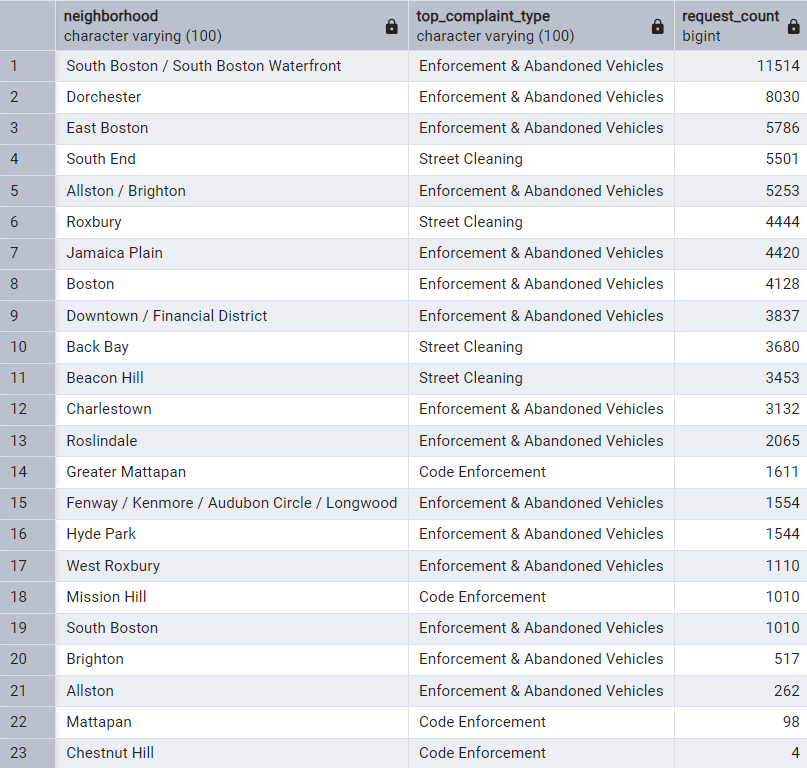
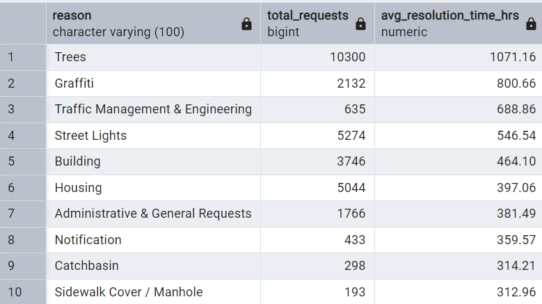
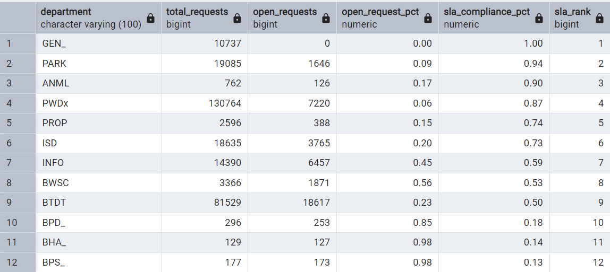
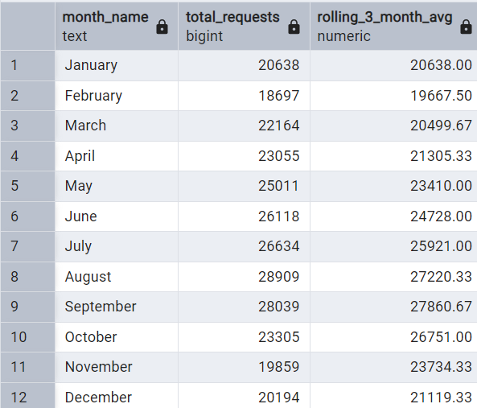

# Boston 311 Service Requests: SQL Analytics Case Study

This project analyzes 311 service request data from the City of Boston using advanced SQL to extract operational and service performance insights. Through structured queries and analytical techniques, it examines how city departments handle resident complaints, evaluates resolution efficiency, and identifies which submission channels are most frequently used. The goal is to uncover trends in service delivery, assess departmental workload and compliance with service-level agreements (SLAs), and inform opportunities for operational improvement.

<p align="center">
  
</p>

---

## 🔧 Tools & Skills Demonstrated

- PostgreSQL (via pgAdmin)
- **Advanced SQL techniques**:
  - CTEs (Common Table Expressions)
  - Window functions: `RANK()`, `LAG()`, `AVG() OVER`, `FILTER`
  - Aggregations and time-based analysis
  - Query structuring for business storytelling
- Optional visualization in Tableau (to support findings)

---

## 📈 Business Questions & SQL Solutions

Each section below begins with a real-world business question and a summary of the results. The corresponding SQL logic and visualizations are provided in collapsible sections to highlight both the analytical process and the insights derived from the data.


### 1. Which departments meet SLA targets most often, and how long do they take to resolve requests?

This query ranks departments based on their SLA compliance percentage and average resolution time for closed requests.  
It uses conditional aggregation, filtering, and sorting to surface operational performance metrics.

**Result:**  


<details>
  <summary>🧠 View SQL Code</summary>

```sql
SELECT
    department,
    COUNT(*) AS total_requests,
    ROUND(SUM(sla_met)::decimal / COUNT(*), 2) AS sla_compliance_pct,
    ROUND(AVG(resolution_time_hrs), 2) AS avg_resolution_time_hrs
FROM vw_cleaned_requests
WHERE current_status = 'Closed'
GROUP BY department
HAVING COUNT(*) >= 100
ORDER BY sla_compliance_pct ASC, avg_resolution_time_hrs DESC;
```

</details>
<br>

### 2. How many 311 complaints were submitted each month?

This query counts the number of 311 complaints submitted each month by extracting and grouping by the month from the request date. It helps identify monthly patterns and trends in complaint volume across the year.

**Result:**  


<details>
  <summary>🧠 View SQL Code</summary>

```sql
SELECT
    TRIM(TO_CHAR(open_dt, 'Month')) AS month_name,
    COUNT(*) AS total_requests
FROM vw_cleaned_requests
GROUP BY month_name, EXTRACT(MONTH FROM open_dt)
ORDER BY EXTRACT(MONTH FROM open_dt);
```

</details>
<br>

### 3. For the most frequently reported 311 service request types, which submission source is most commonly used and what share of the total requests does it represent?

**Result:**  


<details>
  <summary>🧠 View SQL Code</summary>

```sql
WITH top_reasons AS (
    SELECT reason, COUNT(*) AS total_requests
    FROM vw_cleaned_requests
    GROUP BY reason
    ORDER BY total_requests DESC
    LIMIT 10
),
source_distribution AS (
    SELECT
        r.reason,
        r.source,
        COUNT(*) AS source_count
    FROM vw_cleaned_requests r
    JOIN top_reasons t ON r.reason = t.reason
    GROUP BY r.reason, r.source
),
ranked_sources AS (
    SELECT *,
        RANK() OVER (PARTITION BY reason ORDER BY source_count DESC) AS source_rank
    FROM source_distribution
)
SELECT
    rs.reason,
    rs.source AS top_source,
    rs.source_count,
    t.total_requests,
    ROUND((rs.source_count::decimal / t.total_requests) * 100, 2) AS source_percentage
FROM ranked_sources rs
JOIN top_reasons t USING(reason)
WHERE rs.source_rank = 1
ORDER BY t.total_requests DESC;
```

</details>
<br>

### 4. Which neighborhoods have the most currently open 311 requests and what’s the average time taken to resolve cases in those neighborhoods?

**Result:**  


<details>
  <summary>🧠 View SQL Code</summary>

```sql
SELECT
    neighborhood,
    COUNT(*) FILTER (WHERE current_status = 'Open') AS open_requests,
    COUNT(*) AS total_requests,
    ROUND(AVG(resolution_time_hrs), 2) AS avg_resolution_time_hrs
FROM vw_cleaned_requests
WHERE neighborhood IS NOT NULL
	AND TRIM(neighborhood) <> ''
GROUP BY neighborhood
HAVING COUNT(*) >= 100
ORDER BY open_requests DESC;
```

</details>
<br>

### 5. What are the most common complaint types in each Boston neighborhood?

**Result:**  


<details>
  <summary>🧠 View SQL Code</summary>

```sql
WITH complaint_counts AS (
    SELECT
        neighborhood,
        reason,
        COUNT(*) AS request_count
    FROM vw_cleaned_requests
    WHERE neighborhood IS NOT NULL
      AND TRIM(neighborhood) <> ''
    GROUP BY neighborhood, reason
),
ranked_complaints AS (
    SELECT *,
           RANK() OVER (PARTITION BY neighborhood ORDER BY request_count DESC) AS reason_rank
    FROM complaint_counts
)
SELECT
    neighborhood,
    reason AS top_complaint_type,
    request_count
FROM ranked_complaints
WHERE reason_rank = 1
ORDER BY request_count DESC;
```

</details>
<br>

### 6. Which 311 complaint types take the longest to resolve on average?

**Result:**  


<details>
  <summary>🧠 View SQL Code</summary>

```sql
SELECT
    reason,
    COUNT(*) AS total_requests,
    ROUND(AVG(resolution_time_hrs), 2) AS avg_resolution_time_hrs
FROM vw_cleaned_requests
WHERE resolution_time_hrs IS NOT NULL
GROUP BY reason
HAVING COUNT(*) >= 100
ORDER BY avg_resolution_time_hrs DESC
LIMIT 10;
```

</details>
<br>

### 7. Which departments maintain SLA compliance while managing high workloads and open case volumes?

**Result:**  


<details>
  <summary>🧠 View SQL Code</summary>

```sql
SELECT
    department,
    COUNT(*) AS total_requests,
    COUNT(*) FILTER (WHERE current_status = 'Open') AS open_requests,
    ROUND(
        COUNT(*) FILTER (WHERE current_status = 'Open')::decimal / COUNT(*),
        2
    ) AS open_request_pct,
    ROUND(SUM(sla_met)::decimal / COUNT(*), 2) AS sla_compliance_pct,
    RANK() OVER (ORDER BY ROUND(SUM(sla_met)::decimal / COUNT(*), 2) DESC) AS sla_rank
FROM vw_cleaned_requests
GROUP BY department
HAVING COUNT(*) >= 100
ORDER BY sla_rank;
```

</details>
<br>

### 8. Are departments improving or declining in their SLA performance over time?

**Result:**  


<details>
  <summary>🧠 View SQL Code</summary>

```sql
WITH monthly_sla AS (
    SELECT
        department,
        DATE_TRUNC('month', open_dt) AS month,
        COUNT(*) AS total_requests,
        ROUND(SUM(sla_met)::decimal / COUNT(*), 4) AS sla_pct
    FROM vw_cleaned_requests
    WHERE current_status = 'Closed'
    GROUP BY department, DATE_TRUNC('month', open_dt)
    HAVING COUNT(*) >= 30
),
sla_with_trend AS (
    SELECT *,
        LAG(sla_pct) OVER (PARTITION BY department ORDER BY month) AS prev_month_sla_pct,
        ROUND(sla_pct - LAG(sla_pct) OVER (PARTITION BY department ORDER BY month), 4) AS change_from_last_month
    FROM monthly_sla
)
SELECT
    department,
    TRIM(TO_CHAR(month, 'Month')) AS month_name,
    sla_pct,
    prev_month_sla_pct,
    change_from_last_month,
    total_requests
FROM sla_with_trend
ORDER BY department, month;
```

</details>
<br>

### 9. How is the volume of 311 requests changing over time, and what’s the rolling 3-month average?

**Result:**  


<details>
  <summary>🧠 View SQL Code</summary>

```sql
WITH monthly_volume AS (
    SELECT
        DATE_TRUNC('month', open_dt) AS month,
        COUNT(*) AS total_requests
    FROM vw_cleaned_requests
    GROUP BY DATE_TRUNC('month', open_dt)
),
volume_with_rolling_avg AS (
    SELECT
        month,
        total_requests,
        ROUND(
            AVG(total_requests) OVER (
                ORDER BY month
                ROWS BETWEEN 2 PRECEDING AND CURRENT ROW
            ), 2
        ) AS rolling_3_month_avg
    FROM monthly_volume
)
SELECT
    TRIM(TO_CHAR(month, 'Month')) AS month_name,
    total_requests,
    rolling_3_month_avg
FROM volume_with_rolling_avg
ORDER BY month;
```

</details>
<br>

### 10. Were there any months in 2024 with unusually high complaint volumes compared to the typical pattern?

**Result:**  


<details>
  <summary>🧠 View SQL Code</summary>

```sql
WITH monthly_volume AS (
    SELECT
        DATE_TRUNC('month', open_dt) AS month,
        COUNT(*) AS total_requests
    FROM vw_cleaned_requests
    GROUP BY DATE_TRUNC('month', open_dt)
),
volume_stats AS (
    SELECT
        AVG(total_requests) AS avg_volume,
        STDDEV(total_requests) AS stddev_volume
    FROM monthly_volume
),
volume_with_zscore AS (
    SELECT
        mv.month,
        mv.total_requests,
        ROUND((mv.total_requests - vs.avg_volume) / vs.stddev_volume, 2) AS z_score
    FROM monthly_volume mv
    CROSS JOIN volume_stats vs
)
SELECT
    TRIM(TO_CHAR(month, 'Month')) AS month_name,
    total_requests,
    z_score
FROM volume_with_zscore
WHERE ABS(z_score) >= 1.5
ORDER BY z_score DESC;
```

</details>
<br>

