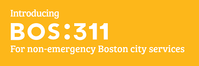

# Boston 311 Service Requests: SQL Analytics Case Study

This project analyzes 311 service request data from the City of Boston using advanced SQL to extract operational and service performance insights. Through structured queries and analytical techniques, it examines how city departments handle resident complaints, evaluates resolution efficiency, and identifies which submission channels are most frequently used. The goal is to uncover trends in service delivery, assess departmental workload and compliance with service-level agreements (SLAs), and inform opportunities for operational improvement.

<p align="center">
  
</p>

---

## 🔧 Tools & Skills Demonstrated

- PostgreSQL (via pgAdmin)
- **Advanced SQL techniques**:
  - CTEs (Common Table Expressions)
  - Window functions: `RANK()`, `LAG()`, `AVG() OVER`, `FILTER`
  - Aggregations and time-based analysis
  - Query structuring for business storytelling
- Optional visualization in Tableau (to support findings)

---

## 📈 Business Questions & SQL Solutions

Each section below begins with a real-world business question and a summary of the results. The corresponding SQL logic and visualizations are provided in collapsible sections to highlight both the analytical process and the insights derived from the data.


### 1. Which departments meet SLA targets most often, and how long do they take to resolve requests?

This query ranks departments based on their SLA compliance percentage and average resolution time for closed requests.  
It uses conditional aggregation, filtering, and sorting to surface operational performance metrics.

**Result:**  


<details>
  <summary>🧠 View SQL Code</summary>

```sql
SELECT
    department,
    COUNT(*) AS total_requests,
    ROUND(SUM(sla_met)::decimal / COUNT(*), 2) AS sla_compliance_pct,
    ROUND(AVG(resolution_time_hrs), 2) AS avg_resolution_time_hrs
FROM vw_cleaned_requests
WHERE current_status = 'Closed'
GROUP BY department
HAVING COUNT(*) >= 100
ORDER BY sla_compliance_pct ASC, avg_resolution_time_hrs DESC;
```

</details>

### 2. How many 311 complaints were submitted each month?

📈 **Result:**  


<details>
  <summary>🧠 View SQL Code</summary>

```sql
SELECT
    TRIM(TO_CHAR(open_dt, 'Month')) AS month_name,
    COUNT(*) AS total_requests
FROM vw_cleaned_requests
GROUP BY month_name, EXTRACT(MONTH FROM open_dt)
ORDER BY EXTRACT(MONTH FROM open_dt);
```

</details>

---

